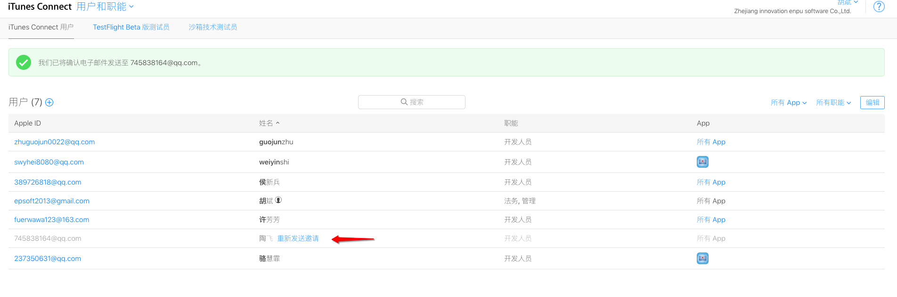
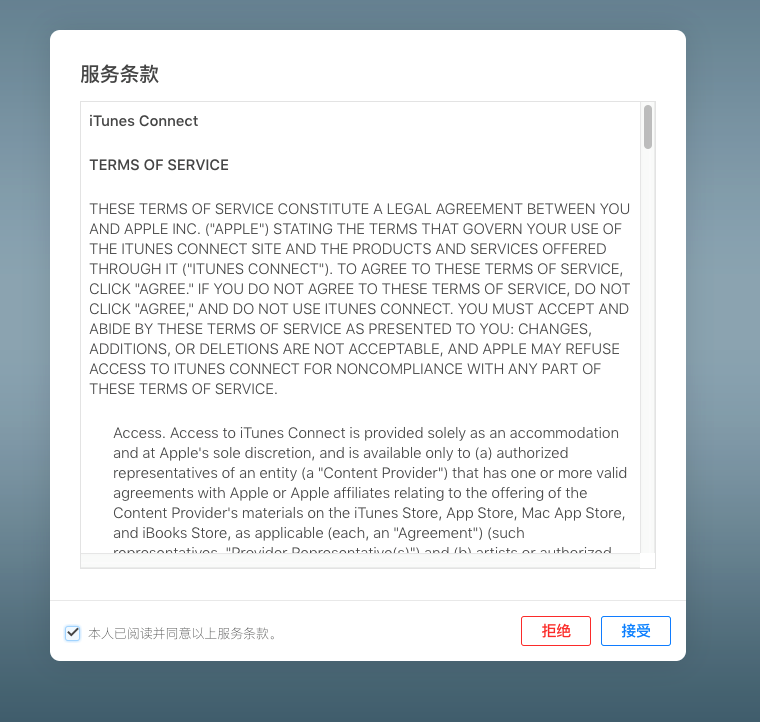
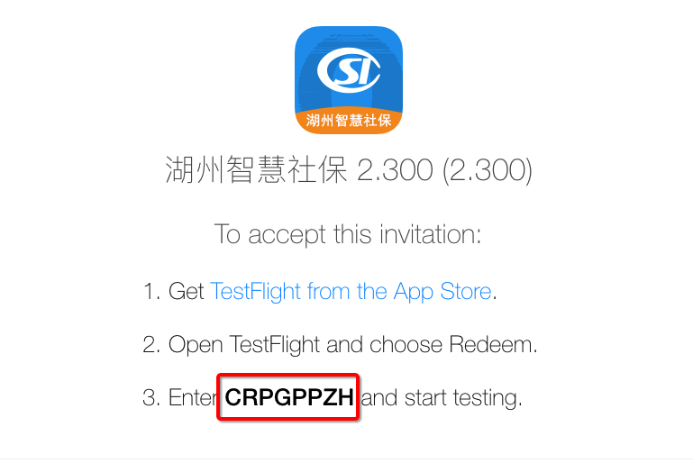

# TestFlight操作手册

​	以前iOS APP 使用的测试方法受限于开发者账号中只能添加100台设备且设备删除不能实时更新。现建议使用苹果公司提供的TestFlight进行`内部测试`和`外部测试`，使用TestFlight进行测试不需要将测试人员的UDID加入开发者账号中。目前TestFlight已经整合进了iTunes Connect，开发者可以通过电子邮件来邀请测试员来进行测试，这样开发者就可以更简单地让内部测试人员以及外部客户等人员一起来测试应用。

​	TestFlight的测试方式分为两种：一种是`内部测试`；一种是`外部测试`。
​	从功能上讲，这两种方式都可以为测试人员在测试阶段对你的App进行测试。所谓的内部主要是指iTunes Connect上在你的开发团队里参与技术开发或者管理的成员，最多可以邀请`25个内部成员`。而与之相对的外部测试，指的是那些不属于你的团队或者公司的测试者，最多可以邀请`2000个外部成员`。这里有一点需要注意的是，在你邀请外部成员参与测试之前，需要先通过苹果的审核，一般审核会在一天左右。而这一限制在内部成员上就没有，也就是说只要你把你的App上传到iTunes Connect上之后内部成员就可以开始进行内部测试了，无需审核。在邀请发出后，有效测试时间为60天。

## TestFlight 内部测试

### 首先登录[iTunes Connect](https://itunesconnect.apple.com/)添加用户

- 使用开发者账号登录iTunes Connect，然后进入`用户和职能`；

  

- 点击iTunes Connect用户，点击添加用户；

  

  `填写用户信息`

  

  `填写用户职能`

  

  `选择协议、付款、财务报告、APP状态报告（可以不选）`

  

- 保存完新添加的iTunes Connect用户信息后，需要去邮箱进行激活验证；

 

### 激活添加的用户

​	登录刚刚添加iTunes Connect用户的邮箱（就是填写用户信息时的邮箱）。会收到苹果的激活邮件。

跳转到iTunes Connect登录页面后，用Apple ID（也就是刚才用的邮箱）登录。登录后会出现相应的服务条款，勾选并同意后就正式成为iTunes Connect用户。

### 邀请iTunes Connect用户添加为内部测试人员

退出之前的iTunes Connect登录的用户，登录主的开发者账号，选择相应的APP进入。添加iTunes Connect用户作为内部测试人员。

到此该项目的内部测试人员已经添加结束。下面刚添加的内部测试人员就可以对改APP进行测试。

### 内部测试人员测试之前的准备工作

​	在测试机上打开App Store并下载TestFlight 

下载完成后，打开TestFlight。后点击Redeem按钮，输入这8个字母即可下载测试app。这里的8位的添加的内部测试人员测邮箱中可以看到。点击View in TestFlight即可查看到。

`点击Redeem时要输入的8位字母邀请码查询如下`

输入完成后即可在手机上的TestFlight中下载并安装被邀请测试的APP。安装完成就可以进行测试了。 

## TestFlight 外部测试

​	在对相应的版本进行外部测试之前要将Xcode打好的IPA包通过Application  Loader将IPA上传至iTunes Connect。上传完成后，稍等10分钟左右，在iTunes Connect中相应的APP下面就可以查看到上传的构建版本。点击要进行外部测试的构建版本，进行外部测试人员的添加。

点击添加独立测试人员

添加外部测试人员到相应APP的特定构建版本。

在添加的时候会出现这样的提示，将我们上传的构建版本上传进行审核。这里需要输入APP中可以登录的账号和相应的密码供审核只用。审核时间为一个工作日左右。审核通过后会通知相关的人员进行测试。审核通过后即可进行测试。

以上是单个添加外部测试用户，我们还可以新建相应的群组，向群组中添加成员，将该群组中的人员加入到指定APP的特定版本作为外部测试人员进行测试。

新建完群组就可以对群组中测试人员进行添加和删除，后面在进行外部测试的时候可以将特定群组的测试人员作为外部的测试人员让其对APP进行测试。

​	在这里添加完成外部联系人以后等构建版本审核通过后，外部测试人员可以用手机在App Store上下载TestFlight，下载完成后，打开TestFlight。后点击Redeem按钮，输入这8个字母即可下载测试app。这里的8位字母是添加外部联系人时苹果官方发送到外部联系人邮箱的邀请码，登录外部联系人的邮箱后，点击View in TestFlight即可查看到。输入完成后即可进行下载安装并进行测试。